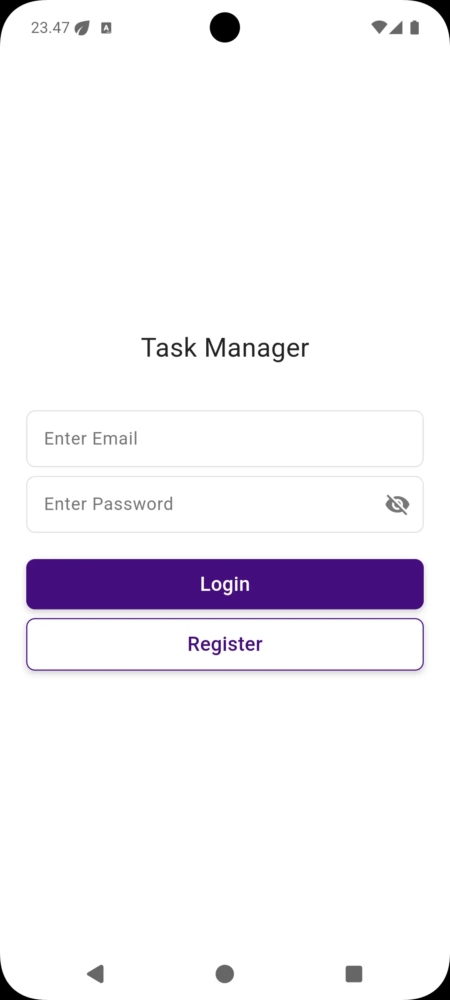
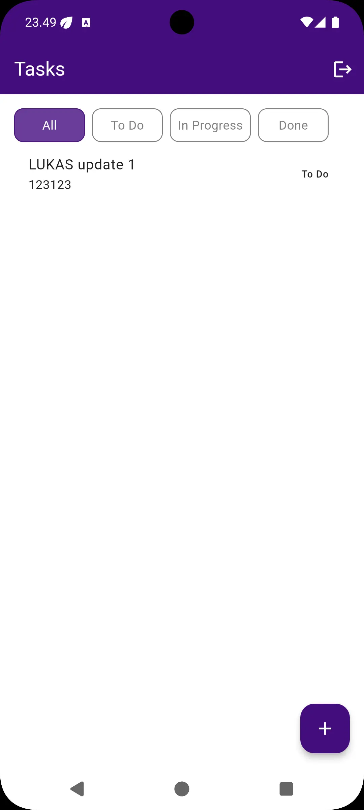
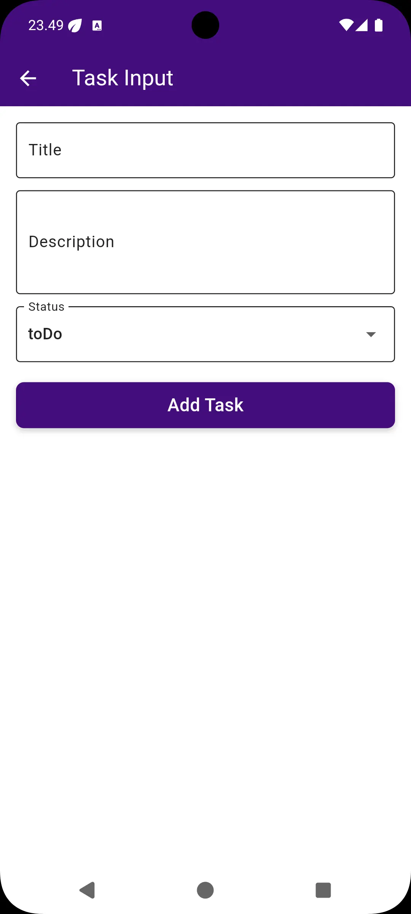
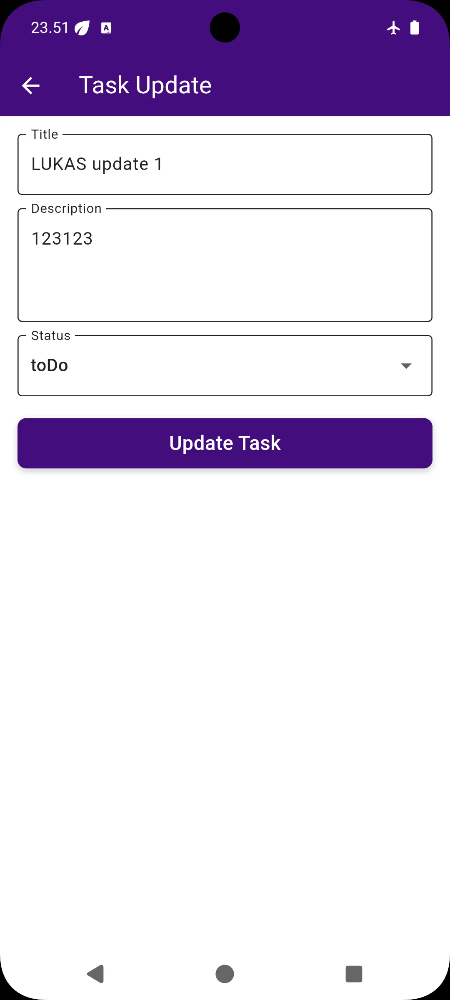
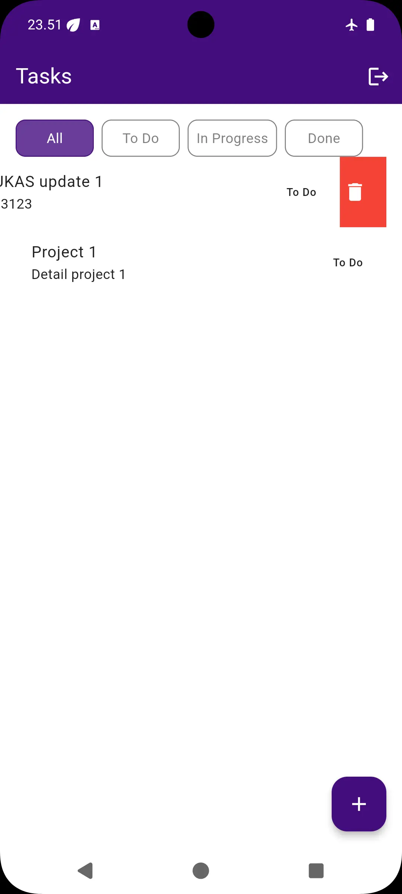
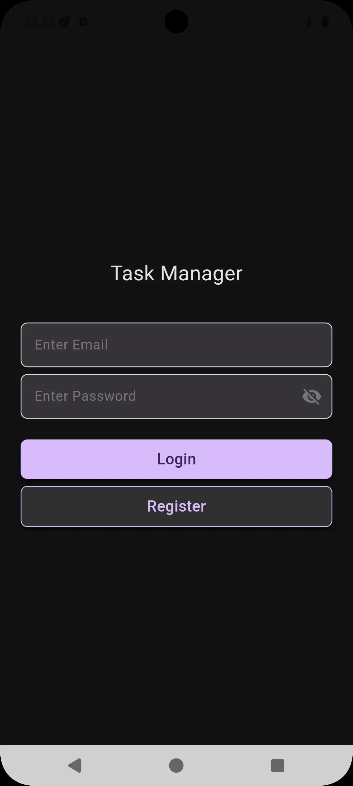
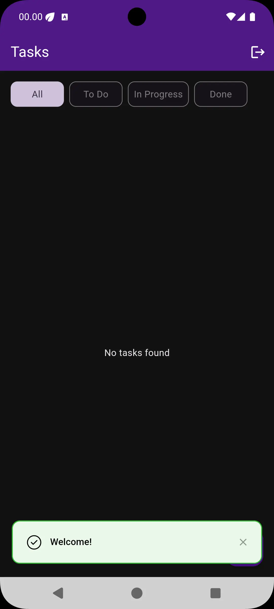
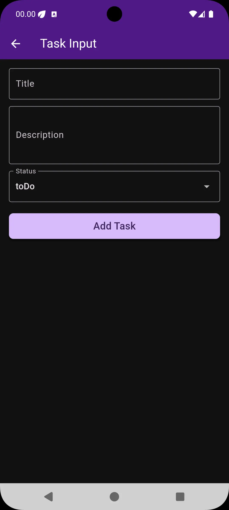
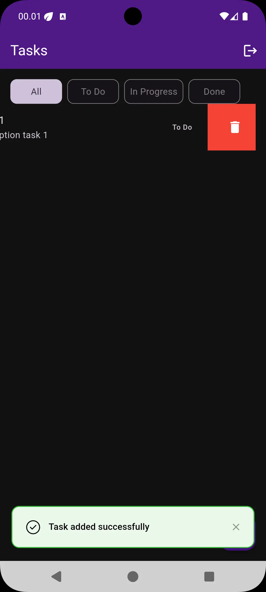

# Task Manager App


A scalable and maintainable **Flutter Task Management App** built with Clean Architecture principles, using Hive for local storage, Firebase Realtime Database for remote data, Bloc for state management, and GoRouter for navigation.

---

## Offline Sync Mechanism

The app includes a full offline capability:

- When the device is **offline**, actions like **Add**, **Update**, and **Delete** tasks are stored in **Hive (local storage)** with a `pendingSync` or `deletedId` flag.
- Once the device regains **internet connection**, a **background sync** process automatically:
  - Uploads `pendingSync` tasks to Firebase
  - Deletes any queued deletions from the server
  - Updates the local cache to reflect the latest server state

This allows a seamless experience even in poor connectivity environments.

---

## Architecture Overview

This project follows the **Clean Architecture** pattern and is structured into four primary layers + routing:

```
├── core
│   └── services, utilities, di
├── data
│   └── repositories, data sources (local/remote)
├── domain
│   └── entities, use cases
├── presentation
│   └── UI, pages, blocs
└── router
    └── route definitions (GoRouter)
```

### Layers

#### 1. **Core Layer**

- Contains utility classes and services.
- Includes:
  - `ConnectivityService`
  - `SecureStorageService`
  - Routing (`router.dart`)
- Dependency injection powered by `injectable`.

#### 2. **Data Layer**

- Handles data access and manipulation.
- Contains:
  - `RemoteDataSource` (e.g. `AuthRemoteDataSource`, `TaskRemoteDataSource`)
  - `LocalDataSource` (e.g. `TaskLocalDataSource`)
  - Repositories implementation (e.g. `AuthRepositoryImpl`, `TaskRepositoryImpl`)

#### 3. **Domain Layer**

- Business logic layer.
- Contains:
  - `Entities`: e.g. `UserEntity`, `TaskEntity`
  - `UseCases`: e.g. `LoginUseCase`, `GetTasksUseCase`

#### 4. **Presentation Layer**

- UI and state management.
- Contains:
  - Screens: `login_page.dart`, `task_list_page.dart`
  - Blocs: `auth_bloc.dart`, `task_bloc.dart`
- Uses `flutter_bloc` for reactive state management.

#### 5. **Routing**

- Navigation handled with `GoRouter`.
- Routes defined in:
  - `router.dart`
  - `page_router.dart`

---

## Diagram

```
┌─────────────────────────────┐
│        Core Layer           │
│  Services, Utilities, DI    │
└────────────┬────────────────┘
             │
┌────────────▼─────────────┐
│      Data Layer          │
│ Repositories, DataSources│
└────────────┬─────────────┘
             │
┌────────────▼─────────────┐
│     Domain Layer         │
│ Entities & Use Cases     │
└────────────┬─────────────┘
             │
┌────────────▼─────────────┐
│  Presentation Layer      │
│ UI + Bloc State Mgmt     │
└────────────┬─────────────┘
             │
┌────────────▼─────────────┐
│      Routing Layer        │
│     GoRouter Structure    │
└──────────────────────────┘
```

---

## Tech Stack

| Tech              | Description                          |
| ----------------- | ------------------------------------ |
| Flutter           | Cross-platform UI Toolkit            |
| Hive              | Local storage for offline caching    |
| Firebase Database | Cloud-hosted real-time backend       |
| Bloc              | Predictable state management         |
| GoRouter          | Declarative routing solution         |
| injectable        | Dependency Injection via annotations |
| mockito           | Unit testing with mocks              |
| dartz             | Functional programming primitives    |

---

## 🧪 Running Tests

```bash
flutter pub run build_runner build --delete-conflicting-outputs
flutter test
```

---

## Getting Started

```bash
git clone https://github.com/lukaskris/taskmanager.git
cd taskmanager
flutter pub get
flutter run
```

---

## Folder Structure

```txt
/lib
  ├── core/
  ├── data/
  ├── domain/
  ├── presentation/
  ├── router/
  └── main.dart
```

---

## Screenshots

### Light Mode

| Login                              | Task List                              | Add Task                                | Update Task                              | Delete Task                              |
| ---------------------------------- | -------------------------------------- | --------------------------------------- | ---------------------------------------- | ---------------------------------------- |
|  |  |  |  |  |

### Dark Mode

| Login                             | Task List                             | Add Task                               | Update Task                              | Delete Task                             |
| --------------------------------- | ------------------------------------- | -------------------------------------- | ---------------------------------------- | --------------------------------------- |
|  |  |  |  |  |

---

## CI/CD (GitHub Actions)

This project includes a GitHub Actions workflow to:

- Run `flutter analyze`
- Run all `flutter test`s
- Optionally build coverage and artifacts

See `.github/workflows/flutter_ci.yml`

---

## License

This project is licensed under the MIT License. See [LICENSE](LICENSE) for more information.

---

## Acknowledgements

- [Bloc](https://bloclibrary.dev/)
- [Hive](https://docs.hivedb.dev/)
- [Firebase](https://firebase.google.com/)
- [GoRouter](https://pub.dev/packages/go_router)
- [injectable](https://pub.dev/packages/injectable)

---

## Contributors

Feel free to open PRs, issues, or suggestions!

---

## Contact

For questions, feel free to reach out at: [lukaskris12@gmail.com](mailto:lukaskris12@gmail.com)
